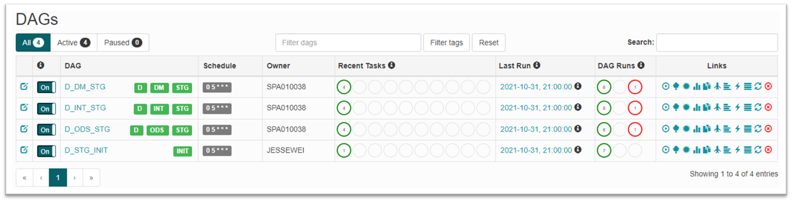

# How-to Guide

## Deploy

### Preparation

- PGM:
  - 存放 DDL/SQL, 分別為需上版的 schema 與 stored procedure
    - 使用中介檔(Data inventory), 
    - 產出目錄: C:\temp\etl\UMC
- DDL: PROFILE 選擇 非 UMC-DEPLOY.cfg 
  - ODP-FIT.ddl 更名為 {DOMAIN}-{DATA_ZONE}.ddl
- SQL: PROFILE 選擇 UMC-DEPLOY.cfg 
  - ODP-FIT.sql 更名為 {DOMAIN}-{DATA_ZONE}.sql
- SCH:
  - 存放 dag 檔,
    - 使用 Planner  
    - 產出目錄: C:\temp\pln\ODP\DEV\FULL_PLAN\ETLIWSJOB
- DAG:
  - sqlg_dag_{DOMAIN}.py

### Validation

- AP 同仁收到平台管理員上版通知後, 要監控任務並排除異常原因 

